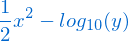

```{r setup, include=FALSE}
knitr::opts_chunk$set(echo = TRUE)
```


# Objectives of session #1

---------------------------------------------------------------------------------------------------------


 - Exploring RStudio environment and workflow
 
 - Understanding the basics of _Rmarkdown_ format
 
 - Starting a work session
 
 - Using the help system
 
 - R as a (sophisticated) calculator
 
 - Vectors and matrices - understanding the differences
 
 - Vector and matrix indexation


# Starting the course work session in R/RStudio

---------------------------------------------------------------------------------------------------------

 [ __PLEASE READ THE INSTRUCTIONS BELOW VERY CAREFULLY!!__ ]


__Note 1__: Probably, you already received some initial instructions to download and start the course project so, if that happened, ignore steps 1 to 3

__Note 2__: If you did not follow any specific instructions, please go through steps 1 to 3 to guarantee that you have the right files and setup


__INSTRUCTIONS__:

  1. Using your internet browser go to the R introduction lessons repository in GitHub: [https://github.com/joaofgoncalves/R-intro-2018]

  2. Download the complete repository using the right green __"Clone or download"__ button and select the __"Download zip"__ option;

  3. After completing the download, uncompress the zip file to a location of your choice;

  4. Open _RStudio_ and go to: _File_ > _Open project..._ > navigate to the project location, select the _R-intro-course.Rproj_ file and select open;

  5. If everything is OK, then you should have a working session with the course files directly available (see the _Files_ tab);

  6. Also, in the console tab, you should be able to see that the working directory is set to your project's folder.


# R markdown overview

---------------------------------------------------------------------------------------------------------


  - In a nutshell, RMarkdown allows blending text and R code in a seamless way, allowing to create beautiful documents in several different formats (e.g., PDF, HTML)
  
  - Text is simply what you are reading right now and R code is put into special blocks or chunks, like this:
  
```{r}

# Hi! I am a comment inside a R code chunk

print("Hello World!") # I am a line of R code

```

  - R code chunks will actually be interpreted and processed by R and the results are put into the output document

  - To run the whole code chunk press the green triangle (play button) on the right side
  
  - To a run a single line, place the mouse cursor on it and press _Ctrl_ + _Enter_

  - To run (one or) several lines, use first the cursor to select them and then press _Ctrl_ + _Enter_
  
  - The output of the chunk will be printed below it and also in the R _Console_ tab


>  __[NOTE]__

  > > - Although RMarkdown format is extremely useful, in many cases using a simple R script for analyses is enough or even recommended (for that you just have to go to File > New File > R Script) 

  > > - Check out what can be done with RMarkdown in this site: [https://rmarkdown.rstudio.com/gallery.html]
      

# RStudio quick tips

---------------------------------------------------------------------------------------------------------


  - If the R prompt gets too cluttered just click on the _Console_ tab and then press _Ctrl_ + _L_; 

  - If you want to see which objects are currently listed in the R session, just go to RStudio's _"Environment"_ tab (Figure below). Alternatively, you can type `ls()` followed by "Enter" directly in the R console to see a list of the objects. 

  - R comments or notes can be inserted after the hash tag sign `#` (the R compiler just ignores what is after it). Use this to organize your scripts and to enter additional notes that you would like to remember after.


### Ready to start? Yes :-)


  - Start by changing the file header above (right at the top of this file) to include your own name; 
  
  - Save this file with a different name and keep the original version: _"File"_ > _"Save As"_

  - In the following sections start by inspecting and testing the examples (inside the R chunks) and then try to solve the exercises. 


# Using the help system

---------------------------------------------------------------------------------------------------------


R has a very efficient help system that should be used whenever a question or doubt appears about a certain function, operator or data structure. Besides documentation regarding each individual function or procedure this system also contains several working examples.

```{r eval=FALSE, include=TRUE}

# Allows to search the help system about the term or expression 
# within the quotation marks

help.search("anova", package="stats")
??"k-means"

# This allows to search the help system about the function of 
# interest - notice that the function name is passed after the 
# question mark

help("mean")
?range

# Run all examples for that function name

example(summary)
example(plot)

```


### Exercises 1 & 2


1.	Using help() or ? look for the information on the mean, sd, quantile and mad functions. Which statistical metrics do these functions calculate?

```{r eval=TRUE, include=TRUE}

#1)


```


2.	Using help.search() or ?? find the functions that are used to calculate:
   a)	The weighted-mean;
   b)	The pairwise correlation;
   c)	A linear model.

```{r eval=FALSE, include=TRUE}

# 2a)

```

```{r eval=FALSE, include=TRUE}

# 2b)

```

```{r eval=FALSE, include=TRUE}

# 2c)

```


# Operations with vectors

---------------------------------------------------------------------------------------------------------


## Basic operations


In R, vectors are objects or variables with one or more values of the same type: logical, integer, numeric (synonym of double), complex or character. 

The assignment operator (`<-`) allows to assign a value or a series of values (on the right-hand side) to a variable name (placed on the left).

Typically if some value is correctly assigned to a variable, R will show no output whatsoever. To visualize it you have either to put the variable name in the console and press 'Enter' or use functions such as `print()` or `plot()`

See the examples below for the assignment operator and basic algebraic calculations:

```{r eval=FALSE, include=TRUE}

# The basics of the assignment operator (<-)

x <- 12.7 # numeric
y <- 25 # integer
w <- "foo bar" # words/strings are enclosed inside quotation marks

# Algebraic operations

x / y          # division
x * y          # multiplication
x + 7.2        # sum
z <- 10.2 - y  # subtraction
print(z)       # shows the value of z

y ^ 3          # power
sqrt(y)        # square-root
log10(x)       # logarithm of base 10

cos(pi / 4)    # co-sine, pi=3.141593... is a R constant
sin(pi / 4)    # sine
tan(pi / 4)    # tangent


```


### Exercise 3


3. Create the variables `x` and `y` respectively with the following values: 10.2 and 5.7. In case of doubts, check the following help entry regarding arithmetic operators: `?Arithmetic`

Now, calculate the expressions in each of the following equations:      

a)


```{r  eval=TRUE, include=TRUE}

# 3a)

```

b)      


```{r  eval=TRUE, include=TRUE}

# 3b)

```

c)
         

Calculate the above expression and use `print()` function to see the calculated value in `z`  

```{r  eval=TRUE, include=TRUE}

# 3c)

```

d) Get the value of z (from the previous exercise) with one decimal plate only (use the function `round()`; see the help system using `?round` to check the arguments of this function);

```{r  eval=TRUE, include=TRUE}

# 3d)

```


## Concatenating multiple values in vectors


In R, the concatenation function `c()` is used for inputting multiple values in vectors each one of them separated by a comma. 

There are also functions such as `length()` that allow us to see on many elements there are in a vector. 

In addition, vectors can also have different names for each element. Check the examples below to see more details:

```{r eval=FALSE, include=TRUE}

# Input a series of values using the concatenation function c()
# Each value is separated by a comma

elevation <- c(348, 690, 1005, 870)
station   <- c("Chaves", "Bragança", "Montalegre", "Lamas de Mouro")

print(elevation)
print(station)

length(elevation)           # the size of the vector

names(elevation) <- station # defines the name of each element
print(elevation)

# Basic statistics

min(elevation)  # minimum value
max(elevation)  # maximum value
mean(elevation) # average value
sd(elevation)   # standard-deviation

```

Now that you run the examples above try answering the following questions.


### Exercise 4


4. Using the concatenation function `c()`, which allows to input multiple values, create a variable named `t.max` with the following twelve numeric values:

 -    20.7, 18.9, 20.8, 18.8, 19.2, 18.6, 20.5, 20, 19.1, 21.3, 16.9, 18.6     

These values are related to the average temperature of the hottest month (a bioclimatic variable) for several Portuguese climatic stations. 

```{r eval=TRUE, include=TRUE}

# t.max vector

```

Next, create a string (or character) variable named `est.clim` containing the names of the climatic stations associated with the temperature records: 

 -    "Anadia", " Mira", "Nelas", "Guarda", "Caramulo", "S. Jacinto", "Viseu", "S. Muna", "Estarreja", "Fig. Cast. Rodrigo", "Arouca", "Moimenta"       

```{r eval=TRUE, include=TRUE}

# est.clim vector

```

Using the vectors previously created, solve the next exercises:        


a) Add 100 to `t.max` and then calculate the square-root. What happens to the vector? Were the functions applied on one or all the elements of the vector?

```{r eval=TRUE, include=TRUE}

# 4a)

```

b) Determine the size of the `est.clim` vector. Which function did you use?

```{r eval=TRUE, include=TRUE}

# 4b)

```

c) Calculate the mean and the standard-deviation of `t.max`;

```{r eval=TRUE, include=TRUE}

# 4c)

```

d) Calculate `t.max` quartiles and plot them (check functions `quantile` and `boxplot`). Which is the median value of `t.max`?

```{r eval=TRUE, include=TRUE}

# 4d)

```


## Generating sequences of values

R has several ways to generate numeric sequences. These are particularly useful to generate data or simply to select/subset elements in vectors, matrices or data frames.

Check the examples below for generating sequences in R:

```{r eval=FALSE, include=TRUE}


# The : operator allows to generate regular sequences of integers from a to b (a:b)

a <- 1:10
print(a)

b <- 10:-10
print(b)

# Using the function seq() it is possible to generate sequences with a 
# defined start, end, length or incrementing by a certain amount

seq(from = 1, to = 5, length = 4) # [1] 1.000 2.333 3.667 5.000 - by increment is calculated by seq

seq(from = 1, to = 5, by = 0.2) # [1] -2.0 -1.8 ... -0.2 - by increment is defined

# The function rep allows to replicate values

rep(x=c(1,2,3), times=2)

rep(x=c(1,2,3), times=2, each=3)

```


### Exercise 5


a) Create a vector named k containing a regular sequence from 10 to 100 using the colon `:` operator. Calculate the sum of all elements in k (check function `sum()`);

```{r eval=TRUE, include=TRUE}

# 5a)

```

b) Create a vector named v containing a sequence of values from `-pi` to `pi` with intervals of `pi / 100` using the function `seq()`. Then, make a xy-plot of `u = sin(v)` using the values previously inputted in `v` (check function `plot()` for making this graph).

```{r eval=TRUE, include=TRUE}

# 5b)

```


## Logical operations


R has several logical operators, namely: `>` (greater than), `>=` (greater than or equal to), `<` (less than), `<=` (less than or equal to), `==` (exactly equal to), `!=` (not equal to), `!x` (not x), `x | y` (x OR y), `x & y` (x AND y).

These operators are very useful to compare values, control certain routines or to select elements in vectors or matrices.


```{r eval=FALSE, include=TRUE}
# Check if a is greater than b:

a <- 12.7
b <- 25.9
a > b

# Check which values of a verify a certain condition
# TRUE if yes and FALSE otherwise

a <- 1:20
a >= 10

# Generate a sequence with 20 randomly distributed values and check
# which ones are greater than the average:

b <- rnorm(20)
b > mean(b)

```


### Quick exercises

After running the above examples try answering the next questions:

QE 1)

- Have you noticed what happened when a logical operation is performed on a vector (with multiple values)? Is this operation applied to a single value or to all values in the vector - select the correct answer: 

a) Only applied to the first element of the vector

b) The first five elements

c) All elements

```{r}
# Put here the correct answer inside the quotation marks:
print("")
```

QE2) 

- Which Boolean value appears when a condition is positively verified and what is the corresponding integer value? Select the correct answer:

a) TRUE which means 0

b) FALSE which means 0

c) TRUE which means 1

d) FALSE which means 1

```{r}
# Put here the correct answer inside the quotation marks:
print("")
```

QE3) 

- Without running the following R code fragment `sum( (1:10) > 5 )` try to guess what would be the correct output for it - select the correct answer:

a) 1

b) 2

c) 3

d) 4

e) 5

```{r}
# Put here the correct answer inside the quotation marks:
print("")
```


## Vector indexation


Any element (or set of elements) contained in a vector or matrix can be accessed through its index (or indices). 

To do this in R, the square brackets operator is used after the variable name, for example: `x[3]` which will select the 3rd element of `x`, or, `x[c(1,3,5)]` which will select the elements in the 1^st^, 3^rd^ and 5^th^ positions. 

Besides positions given by integer values, indices can also use logical or name values. Using indices also allows to change certain specific values or ranges of values contained in vectors (or even matrices). 

Check the examples below:


```{r eval=FALSE, include=TRUE}

x <- seq(from = 10, to = 500, length = 20)
names(x)<- LETTERS[1:20] # name each element of x with a letter

print(x)

x[2]          # Get the value in the 2nd position
x[-2]         # Select all elements of x except the 2nd position
x[1:4]        # Select elements of x from the 1st to the 4th positions
x[-(1:3)]     # Select all elements except those from 1 to 3
x[c(7,10,12)] # Select elements on positions 7, 10 and 12

x["H"]        # Get x element with name "H"

x[x < 145]                # Select elements with less than 145
x[(x >= 100) & (x < 220)] # Elements within the interval [100, 220[

# Change values:
x[5] <- 100 # Change the value in position 5
x[c(7,9)] <- c(23, 45) # Change the values in position 7 and 9

```


### Exercise 6 (logical operations and vector indexation)

6. Using the data generated in exercise 4 (the vectors `t.max` and `est.clim`) solve the following exercises:

a)	Assign the names of the climatic stations (`est.clim`) to the temperature records (`t.max`) using the function `names()`. Check the examples in the help system;

```{r eval=TRUE, include=TRUE}

# 6a)

```

b)	Select the first five elements of `t.max` using a sequence of integers;

```{r eval=TRUE, include=TRUE}

# 6b)

```

c)	Get the temperature values for stations "Anadia" and "Nelas" (using selection/indexation by name);

```{r eval=TRUE, include=TRUE}

# 6c)

```

d)	Which climatic stations have temperature values above 20 ºC and below or equal to 21 ºC;

```{r eval=TRUE, include=TRUE}

# 6d)

```

e)	Change the value of the "Guarda" station to 19 ºC;

```{r eval=TRUE, include=TRUE}

# 6e)

```


# Matrix operations

---------------------------------------------------------------------------------------------------------


Matrices in R allow to efficiently store and organize data of one type (logical, numeric, character, etc.) in a bi-dimensional structure (with rows and columns). 

It is possible to use names for the rows and the columns to select them appropriately. 

Matrices  allow specific algebra operations to be performed, such as multiplication (`%*%`), the transpose (`t()` function), the determinant (`det()` function) or solving systems of linear equations of the type Ax = b using the function `solve()`.


## Generating matrices


From a vector of data and using the function `matrix()` it is possible to control several aspects of matrix generation. 

In this function it is possible to choose the number of rows (`nrow`), columns (`ncol`) and the orientation of matrix filling (`byrow`). If `FALSE` (the default option) the matrix is filled by columns, otherwise the matrix is filled by rows. 

Also, the parameter `dimnames`, also in the `matrix()` function used to create this type of object, allows to set the names of rows and columns.


```{r eval=FALSE, include=TRUE}

# Generate the 3x3 identity matrix:
id <- matrix(c(1,0,0,0,1,0,0,0,1), nrow = 3)

# Generate a matrix with 2 rows filled by row:
vector<-c(1,2,3,4,4,3,2,1)
v <- matrix(vector, byrow = TRUE, nrow = 2)

# Generate a 10x10 matrix with filling by row:
m <- 1:100
dim(m) <- c(10, 10)  # or alternatively:
m <- matrix(data = 1:100, nrow = 10, ncol = 10, byrow = FALSE)

dim(m) # Get matrix dimensions
 
cbind(m, rnorm(10)) # Add a new column to m

rbind(m, rnorm(10)) # Add a new row to m

rownames(m) <- paste("row", 1:10, sep="_")  # Define row names

colnames(m) <- paste("col", 1:10, sep="_")  # Define column names

```


## Matrix indexing


Accessing elements in matrices is similar to vectors. However, since this structure is bi-dimensional, two indices [row, col] are used inside square brackets. See the next examples.

  - x[i, j]   _# Select the i-th line e a j-th column of x_      

  - x[i, ]    _# Select the line i and all columns_       

  - x[, j]    _# Select the column j and all lines_        
  


```{r eval=FALSE, include=TRUE}

# Matrix indexation

m[, 1:5]         # Select columns 1 to 5
m[, -3]          # Exclude column 3

m[1:5, ]         # Select lines 1 to 5
m[-c(1,3,5), ]   # Exclude lines 1, 3 and 5

m[, c(1,2,10)]   # Select columns 1, 2 and 10.
m[,-1]           # Select all columns except the first

m[, c("col_8", "col_10")]           # Select by column name
m[c("row_1"), c("col_8", "col_10")] # Select by row and column name

                 # Use logical conditions
m[m[,1] > 5, ]   # Select rows for which the value of column 1 is higher than 5 / all cols

# When a given matrix (or data frame) index has dimension one, the 
# drop=FALSE argument allows to keep the matrix format instead of 
# automatically converting it to a vector 

m[,1,drop="FALSE"]  # a column (the parameter drop=TRUE
m[1,,drop="FALSE"]  # a line

```


### Exercise 7

7. The Ministry of Health performed a survey about the average percentage of smokers by gender and city in several schools of the country. Using the data in the table below answer the following questions:

         Aveiro	Braga	Bragança	Porto	Coimbra	Covilhã	Leiria	Lisboa	Setúbal	Faro
    
    Women	50.3	60.6	  71.5	   82.3	  59.9	 79.3	   41.4	   80.9	   72.1	  59.1
    
      Man	54.4	52.4	  67.1	   78.3	  59.2	 65.1	   86.3	   81.3	   57.3	  61.3

a) Which type of data structure (or object type) is more suited to store this information in R - select the correct answer 

  i) One vector with all values
 
  ii) Two vectors with named values
  
  iii) A list
  
  iv) A matrix

```{r eval=TRUE, include=TRUE}

# 7a) The correct option is:
print("")
```

b) Using the type of object selected in a) insert the data into that type of structure (hint: including row and column names)
	
```{r eval=TRUE, include=TRUE}

# 7b)

```
	
c) Which is the average percentage of male smokers?
	
```{r eval=TRUE, include=TRUE}

# 7c)

```
	
d) Find/select the two cities with the highest percentage of smoker women (hint: see `?sort`)

```{r eval=TRUE, include=TRUE}

# 7d)

```
	
e) In which city is the difference between man and women higher?

```{r eval=TRUE, include=TRUE}

# 7e)

```

f) For each city indicate which gender has the highest percentage of smokers (hint: see `?apply` and `?which.max` for a possible solution).

```{r eval=TRUE, include=TRUE}

# 7f)

```

 
Now that you finished and if MikTex or other LaTeX generator is available on your system press the option _Knit_ > _Knit to HTML_ to make a complete HTML page with these exercises or just 

