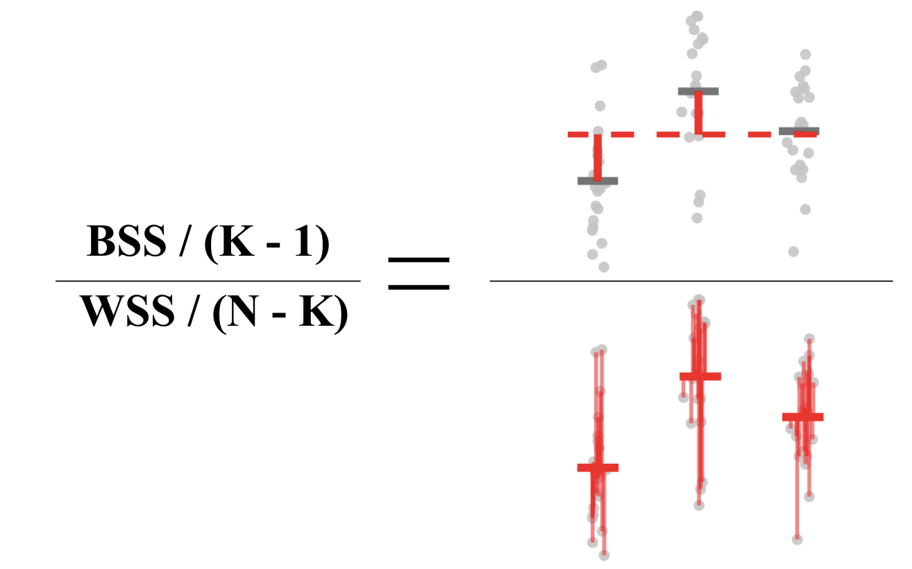

```{r setup, include=FALSE}
knitr::opts_chunk$set(echo = TRUE)
```


## Objectives of session 2

---------------------------------------------------------------------------------------------------------

 - Missing data: `NA` values
 
 - Data frames (as an extension of matrices) 
 
 - Exploratory Data Analysis: scatter-plots and correlation analyses

 - Factor variables
 
 - Plotting and comparing distributions with boxplots

 - Hypothesis testing (t-Test)
 
 - Analysis of variance (one-way ANOVA)


# Missing data in R (NA values)

---------------------------------------------------------------------------------------------------------

In R, missing data are coded as `NA` (_Not Available_). 

Impossible values (e.g., dividing by zero) are represented by the symbol `NaN` (_Not a Number_).

In real datasets, `NA`'s often occur. Unfortunately, most descriptive statistics functions will not work if there is a missing value in the data. 

For example, the following code will return `NA` as a result of a missing value in the data vector:

```{r}
a <- c(1, 5, NA, 2, 10)
mean(a)
```

Using the option `na.rm = TRUE` in the function will allow ignoring `NA` values in computations. Let's try calculating the mean of the vector `a` again, this time with the additional`na.rm = TRUE` argument:

```{r}
mean(a, na.rm = TRUE)
```

The `is.na()` function allows to check for `NA` values in a vector:

```{r}
x <- c(NA,1:5,NA,NA,10:13,NA)
is.na(x)
```

When working with data frames the function `na.omit()` can be used to suppress rows that have `NA` values in them. Check out the example below:

```{r}

x <- data.frame(v1 = c(1:5,NA),
                v2 = c("A","B","D",NA,"C","C"),
                v3 = c(NA,rnorm(5)))

print(x)

na.omit(x) # 3 rows were supressed from the dataset

```

We can also use `complete.cases()` function to check which rows exist _without_ missing values:

```{r}

complete.cases(x)

```


### Exercise 1

1. The following vector contains average temperature records from January to December 2007 for Porto (Portugal):

  -   10.5, NA, 12.3, 14.4, 15.6, 17.7, NA, 20.4, 20.3, 17.1, 13.3, 10.5

a) Insert the data into a vector named `avg_temp`. Calculate how many `NA` values exist in this vector
```{r}

```

b) Calculate the mean and the standard-deviation (hint: check `na.rm` option)
```{r}

```

c) Replace the `NA` values by the overall median (hint: `is.na`)
```{r}

```

d) Replace each `NA` value by the average of the two closest months (hint: use indexation)
```{r}

```


# Dataframes in R

---------------------------------------------------------------------------------------------------------

Matrices and dataframes are very similar to spreadsheets in Excel or data files in SPSS. Every matrix or dataframe contains rows and columns i.e., they have 2-dimensions (nrows or height x ncolumns or width).

While matrices and dataframes look very similar, they aren't exactly the same. While a matrix can contain _either_ character or numeric columns, a dataframe can contain _both_ numeric and character columns. 

Because dataframes are more flexible, most real-world datasets, such as in-field surveys containing both numeric (e.g.; temperature, elevation, slope) and character (e.g.; soil type, land cover class) data, will be stored as data frames in R.

_But, if dataframes are more flexible than matrices, why do we use matrices at all?_

The answer is that, because they are simpler, matrices take up less computational space than dataframes. Additionally, some functions require matrices as inputs to ensure that they work correctly.


## Creating dataframes - the `data.frame()` function

The `data.frame()` function works by you specifying names to each of the columns as you define them. Each column will contain a vector with data.

Let's create a simple dataframe called `survey` using the `data.frame()` function with a mixture of text and numeric columns:

```{r}

survey <- data.frame(
  PlotID = c(1,2,3,4,1,2,3,4),
  Month = c("May","May","May","May","Jun","Jun","Jun","Jun"),
  Elevation = c(110, 12, 321, 425, 110, 12, 321, 425),
  AvgTemp = c(10, 12, 14, 13.5, 14.5, 18.2, 15, 5.16),
  LeafSize = c(2, 3.2, 2.1, 3.4, 2.5, 3.7, 3, 4.1)
)

```


### Quick exercise 1

QE1) Create a dataframe named `precip` with the two following vectors:

  _cities_: "Mobile", "Juneau", "Phoenix", "Little Rock", "Los Angeles", "Sacramento", "San Francisco", "Denver", "Hartford", "Wilmington"
  
  _precipitation_: 67.0, 54.7, 7.0, 48.5, 14.0, 17.2, 20.7, 13.0, 43.4, 40.2

```{r}

```


# Exploratory data analysis - scatterplots and correlations

---------------------------------------------------------------------------------------------------------


Exploratory Data Analysis (EDA) is an approach in data analysis that uses a variety of techniques and "simple" statistical measures to evaluate the following aspects:

  - Maximize insight into a data set;
  
  - Uncover underlying structure namely associations between variables;
  
  - Extract important variables for further analysis/modelling;
  
  - Detect outliers and anomalies in observations;
  
  - Test underlying assumptions (e.g., normality, heteroskedasticity);
  
  - Develop parsimonious models.

In the next exercise we will approach this by analyzing a sample dataset and combining the usefulness of scatterplots and correlation analyses (i.e., a statistical measure quantifying a mutual relationship or association between two variables).


### Exercise 2

2. In this exercise we will use an R "internal" dataset named `airquality` (containing daily air quality measurements for New York, from May to September 1973) to learn how to manipulate dataframes in a simple analysis.

a) Check if the dataset has missing values (hint: use `complete.cases`). If yes, create a new dataset named `aq` by removing all rows with `NA`'s
```{r}

```

b) Using the function `summary` indicate the average values for the `Ozone` concentration and `Wind` speed
```{r}

```

c) Make a x-y scatter-plot (function) between Ozone concentration (in ppb; column named `Ozone` - in the y-axis) and wind speed (in mph; column `Wind` - in the x-axis). Select the correct option for what you observe in the plot - there is a:

i) Positive and linear correlation;

ii) Positive and non-linear correlation;

iii) Negative and linear correlation;

iv) Negative and non-linear correlation;

```{r}
print("")
```

d) Use the function `plot` on the `aq` data frame. Overall, which variables seem more clearly correlated/associated to `Ozone` concentration?
```{r}

```


d) Use the function `cor.test` to analyze the Spearman non-parametric correlation between `Ozone` and each one the following variables: (i) `Solar.R` (solar radiation in lang), (ii) `Wind` (wind speed in mph), and (iii) `Temp` (temperature in degrees F) (hint: check the parameter `method` in `?cor.test`)

```{r}

# (i)

# (ii)

# (iii)

```


## Dataframe indexation with [ , ]

 
Similarly to matrices, data frames also use two indices [row, col] inside square brackets for subsetting/slicing rows and/or columns. See the examples below:

  - x[i, j]               _# Select the i-th row e a j-th column of x_      

  - x[i, ]                _# Select the row i and all columns_ 
  
  - x[1:10, ]             _# Select the rows 1 to 10 and all columns_
  
  - x[-c(15,22), ]        _# Exclude rows 15 and 22 and select all columns_

  - x[, j]                _# Select the column j and all rows_ 
  
  - x[, c("v1", "v2")]    _# Select the columns named v1 and v2 and all rows_ 

  - x[, 1:3]              _# Select the columns in positions 1 to 3 and all rows_ 
  
  - x[, -5]               _# Exclude the column in position 5_


### Exercise 3

Using the previously created `aq` dataset (i.e., `airquality` without `NA`'s) answer to the following questions:

a) Subset the dataframe by excluding the columns from the third to the last position (hint: see `?ncol`)
```{r}

```

b) Select columns named `Day` and `Month` (in this order)
```{r}

```

c) Select rows 1,2, and 3
```{r}

```

d) select the last ten rows (hint: `nrow` or `tail`)
```{r}

```

e) Select the rows with above average `Ozone` concentration
```{r}

```

f) Select the rows below the 10-percentile value of `Ozone` concentration (hint: quantile)
```{r}

```


## Slicing with `subset()`


The `subset()` function is one of the most useful data management functions in R. It allows you to slice a dataset just like you would with brackets, but the code is much easier to write. The table below shows the main arguments of `subset()` function:

| Argument | Description                                  | 
|:---------|:---------------------------------------------|
| `x`      | A dataframe you want to subset               | 
| `subset` | A logical vector indicating the rows to keep | 
| `select` | The columns you want to keep                 | 

Let's use the `subset()` function to create a new, subsetted dataset from the `ToothGrowth` (an internal dataset containing data for guinea pigs) for the three following conditions:

  - tooth length less than 20cm (`len < 20`), 
  - given the OJ supplement (`supp == "OJ"`), and 
  - dose greater than or equal to 1 (`dose >= 1`).

```{r}
# Get rows of ToothGrowth where len < 20 AND supp == "OJ" AND dose >= 1
subset(x = ToothGrowth,
      subset = len < 20 &
               supp == "OJ" &
               dose >= 1)
```

As you can see, there were only two cases that satisfied all 3 of our selection criteria.


### Quick exercise 2

QE2) Using the `subset` function and the `aq` dataset previously created, slice it with the following conditions combined:

  - `Ozone` higher than 80 ppb
  - `Temp` higher than 90 ºF
  - `Wind` lower or equal to 5 mph


# Factor variables

---------------------------------------------------------------------------------------------------------


In R, factors are used to work with categorical variables, i.e., variables that have a fixed, discrete and known set of possible values. 

They are also useful when you want to display character vectors in a non-alphabetical order.

```{r eval=TRUE, include=TRUE}

# Imagine that you have a variable that records the month
x <- c("Dec", "Apr", "Jan", "Mar")

# These are the correct values for the different months in the 'right' order
month_levels <- c(
  "Jan", "Feb", "Mar", "Apr", "May", "Jun", 
  "Jul", "Aug", "Sep", "Oct", "Nov", "Dec"
)

# Now let's create a factor variable
y <- factor(x, levels = month_levels)

print(y)


```

We can also use `factor()` to generate ordered variables (_'Likert-type scale'_)

```{r eval=TRUE, include=TRUE}

# In this example we can see the agreement level in 35 questionnaires: 
opinion <- c(1,1,2,3,3,3,1,2,4,5,5,5,1,3,4,4,4,2,1,3,4,5,3,2,3,3,3,4,3,3,4,5,4,3,5)

# Levels related to each response from 1 to 5
opinion_levels <- c("Strongly disagree","Disagree","Neutral","Agree","Strongly agree")

# Create a factor variable
opinion_fact <- factor(opinion_levels[opinion], levels = opinion_levels, ordered = TRUE)

print(opinion_fact)

# `levels()` function can be used to check which categories exist
levels(opinion_fact)

```

We can also change the categories afterwards using `levels()` function:

```{r eval=TRUE, include=TRUE}

opinion_fact <- factor(opinion, ordered = TRUE)

levels(opinion_fact) <- opinion_levels

print(opinion_fact)

```

Now, we can use the factor variables to analyze the frequency of responses by each different level:

```{r eval=TRUE, include=TRUE, fig.width=7, fig.height=5}

# Frequency table
table(opinion_fact)

# Or a boxplot
barplot(table(opinion_fact))

```


### Exercise 4

4. In this exercise we will use an internal R dataset known as `iris` containing measurements (in centimeters) of the variables _sepal length_ and _width_ and _petal length_ and _width_, respectively, for 50 flowers from each of 3 species of Iris plants (column _Species_ of the dataset).


a) What type of variable is `Species` in the `iris` dataset: character or factor? (hint: use function `class` or `is.factor` to check the correct option)

```{r}

# Use the line below to call the data
data(iris)
head(iris) # This is used to make a first check of the data


```

a) Which species of _Iris_ actually exist in the dataset? (hint: check _Species_ column and the different `levels`)

```{r}

```

c) How many observations _per species_ exist in the data

```{r}

```

d) What is the average of petal length by species? (hint: use `colnames` to check column names and `by` to apply a function split by factors)

```{r}

```

e) What is the standard-deviation of petal length by species?

```{r}

```


# Analyzing distributions

---------------------------------------------------------------------------------------------------------

## Exploratory data analysis for visualizing distributions

Boxplots are a graphical representation of the five number summary, showing the data quartiles (i.e. the 25%, 50%, and 75% quantiles), minimum, maximum and outliers (if these exist). 

Boxplots convey the shape of the data distribution, the presence of extreme values, and the ability to compare with other variables using the same scale, providing an excellent tool for screening data, determining thresholds for variables and developing working hypotheses.


### Exercise 5

5. In this exercise we will continue our exploration of the `iris` dataset and analyze differences in the distribution of different leaf structures between species.


a) Using a formula in the `boxplot` function (i.e., `variable ~ group`) make a plot for each one of the variables by species:

  - `Sepal.Length` 
  - `Sepal.Width` 
  - `Petal.Length` 
  - `Petal.Width`

```{r}

```

b) Using the plots from the previous exercise, try to answer the following questions by visual interpretation:

  i) Overall, which leaf structure seems to separate better the species: sepals or petals?

  ii) Which variable better differentiates _Iris setosa_ from the two other species?

  iii) Overall, which variable seems to perform worst in terms of species differentiation?


## Hypothesis testing

Two-sample (unpaired) _t-tests_ are often used to compare the means from two different groups of data under the assumption that both samples are random, independent, and come from normally distributed populations with unknown variances. 

This test can help to verify if means are significantly different from one another. In that case, we can say that the variable being manipulated (the independent variable), had an effect on the variable being measured (the dependent variable).


```{r fig.width=6, fig.height=4}

# In this example we will test the null hypothesis (H0) that the average for the men's weight is equal to the women's:
# H0: AVG(m) = AVG(w)
# 
# Therefore the alternative hypothesis (Ha) is that of difference between the means:
# Ha: AVG(m) != AVG(w) 
#

women_weight <- c(38.9, 61.2, 73.3, 21.8, 63.4, 64.6, 48.4, 48.8, 48.5)
men_weight <- c(67.8, 60, 63.4, 76, 89.4, 73.3, 67.3, 61.3, 62.4) 

# Histogram
par(mfrow = c(1,2))
hist(women_weight)
hist(men_weight)

# Boxplot
par(mfrow = c(1,1))
boxplot(list(Women=women_weight, Men=men_weight), col="light grey")

# Two-sample unpaired t-Test
t.test(women_weight, men_weight)

```

Given that our p-value is below 0.05, we can reject the null hypothesis of equal averages.


### Exercise 6

6. In this exercise we will use the `PlantGrowth` dataset which contains experimental results comparing yields (dried weight of plants) obtained under a control and two different treatment conditions. `PlantGrowth` is a data frame with 30 cases/observations and 2 variables: 
- [, 1]	 _weight_ (numeric)
- [, 2]	 _group_ (factor)

The levels of group are 'ctrl' (control), 'trt1', and 'trt2' (treatments 1 and 2).

a) Make a boxplot for comparing the distribution of the weight by group
```{r}

```

b) Use a t-test to check if the is a difference between the control group and treatment 1
```{r}

```


c) Use a t-test to check if the is a difference between the control group and treatment 2
```{r}

```


## Analysis of variance (one-way)


_ANalysis Of VAriance_ (ANOVA), is a widely used method designed for comparing differences in means among three or more groups.

For example, we might be interested in comparing the average yield or plant weight for three different types of fertilizers. Or perhaps we have conducted a experimental trial comparing the effectiveness of five different treatments to avoid a certain pathogen.

The key is that each individual falls into a group described by a (categorical) grouping variable (e.g. treatment type and or intensity) and for each individual we measure some continuous outcome (e.g., plant status).

Although there are multiple types of ANOVA, the simplest ("one-way" ANOVA) can be thought of as a generalization of a two-sample t-test. One-way ANOVA involves testing the omnibus hypothesis that k population means are identical:

$$H0: \mu_1 = \mu_2 = ... = \mu_k$$

The alternative hypothesis for ANOVA states that any one of the population mean equalities does not hold:

$$H1: \mu_i \neq \mu_j, \text{ for some } i \neq j$$

It is important to note that a rejection of the null hypothesis (H0) __does not tell you which of the population means differ__. It only tells you that there is some population whose mean is different from at least one other population (it could be that all of the means are different from one another!)

The basic idea is that if the variability between the groups is greater than the variability within the groups, then we have evidence that the differences between the groups is not simply reflecting random noise.

Quantifying the within and between group variability is typically done by calculating a _mean sum of squares_ (SS): add up the squared vertical distances and divide by the degrees of freedom.

This means that we are comparing the:

- _Between sum of squares (BSS)_: the squared distances from the group means (average over all individuals separately for each group) to the global mean (average over all individuals),

_vs._ the

- _Within sum of squares (WSS)_: the squared distances from each individual to their group mean (average over all individuals within the same group).




_ANOVA assumptions_ are the following:

- _Assumption 1_: The samples are independent;
- _Assumption 2_: The data are normally distributed;
- _Assumption 3_: Each group has the same variance.

If the data generally satisfies these parametric assumptions (which can be checked individually), then we can show that this test statistic follows an _F_-distribution and we can do a straightforward parametric hypothesis test as:

$$\text{p-value}=P \left( F_{k-1,N-k} \geq \frac{BSS/(K-1)}{WSS/(N-K)} \right)$$

A quick-example! Using the previous `PlantGrowth` dataset we will check if there is a different between the group means using the `aov` function:

```{r}

res.aov <- aov(weight ~ group, data = PlantGrowth)

summary(res.aov)

```

As the p-value is less than the significance level of 0.05, we can conclude that there are significant differences between the groups highlighted with "*" in the model summary above.


### Exercise 7

7. Using the `iris` dataset answer to the following questions:

a) Using the ANOVA function `aov` check if there are significant differences in terms of _sepal width_ across iris species
```{r}

```

b) Using the ANOVA function `aov` check if there are significant differences in terms of _petal width_ across iris species
```{r}

```


### Exercise 8

8. In this exercise we will use a sample dataset (in the `"diet.csv"` file; see folder Session-02) with information on 76 people who undertook one of three diets (referred to as diet A, B and C). There is also background information such as age, gender, and height. The aim of the study was to see which diet was best for losing weight.

a) Read the data file `diet.csv` using function `read.csv()` (hint: use the help on `?read.csv` in case of doubt)
```{r}

```

b) Check and remove any existing missing values from the dataset
```{r}

```

c) Convert the variable named `Diet` into a factor variable `Treatment` with three levels 1 - "Trt-A", 2 - "Trt-B", 3 - "Trt-C"
```{r}

```

d) Calculate a variable named `Weight.Loss` as the difference between `weight6weeks` and `pre.weight` and add it to the data frame
```{r}

```

e) Using one-way ANOVA check for if the differences in weight loss across treatments are significant 
```{r}

```


