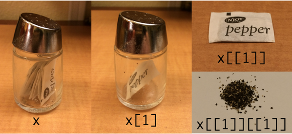

R-intro - Session #3
========================================================
author: Joao Goncalves
date: 30 July 2018
autosize: true
css: custom.css


List objects
========================================================
class: small-code

__Lists__ can store virtually _anything_ which makes it pretty useful

You can have a list that contains several vectors, matrices, or dataframes of any size and class

Lists are also useful to represent hierarchical or nested data structures


List objects
========================================================
class: small-code


- To start a list object you use the function `list()`
- Each list element is separated by a `,` (comma)


```r
myList <- list(
  x = rnorm(10), # 10 randomly generated numbers with normal(0,1) distribution
  y = rnorm(5),  # 5 randomly generated numbers with normal(0,1) distribution
  z = matrix(1:9, nrow = 3, ncol = 3) # A 3x3 matrix
)

print(myList)
```

```
$x
 [1] -0.347418498 -1.072266349  0.767175365  0.004775063  0.812081056
 [6] -0.525053624  0.263281923 -1.978511526  0.999902774 -0.162634656

$y
[1]  0.92645259  0.50208423 -0.09504507  0.77351698 -0.84975169

$z
     [,1] [,2] [,3]
[1,]    1    4    7
[2,]    2    5    8
[3,]    3    6    9
```


List objects
========================================================
class: small-code

- To access an element in a list, use double brackets `[[]]` 

- Or `$` if the list has names. 


```r
# Access the thrid element of the list 
myList[[1]]
```

```
 [1] -0.347418498 -1.072266349  0.767175365  0.004775063  0.812081056
 [6] -0.525053624  0.263281923 -1.978511526  0.999902774 -0.162634656
```

```r
# Access the list by name using [[]] or $
myList[["y"]]
```

```
[1]  0.92645259  0.50208423 -0.09504507  0.77351698 -0.84975169
```

```r
# or
myList$y
```

```
[1]  0.92645259  0.50208423 -0.09504507  0.77351698 -0.84975169
```


List objects
========================================================
class: small-code
left: 40%

- If single brackets `[]` are used the list will keep it's format


```r
# Access the thrid element of the list (without simplification)
myList[3]
```

```
$z
     [,1] [,2] [,3]
[1,]    1    4    7
[2,]    2    5    8
[3,]    3    6    9
```

```r
class(myList[3])
```

```
[1] "list"
```

---




Custom or user-defined functions
========================================================
class: small-code

- Functions allow you to automate common tasks in a more powerful and general way than copy-and-pasting.

- Custom functions are often used to avoid repeating code

- Allows to generalize code structures

- Reuse code between different projects


Components of a function (1/4)
========================================================
class: small-code


Your custom functions will have the following 4 attributes:


```r
# The basic structure of a function

NAME <- function(ARGUMENTS) {

  # ACTIONS

  return(OUTPUT)
}

```

---

- __Name__: What is the name of your function? You can give it any valid object name.


Components of a function (2/4)
========================================================
class: small-code


```r
# The basic structure of a function

NAME <- function(ARG1, ARG2, ARG3 = DEFAULT_VALUE) {

  # ACTIONS

  return(OUTPUT)
}
```

---

- __Arguments__: What are the inputs to the function? Does it need a vector of numeric data? Or some text? You can specify as many inputs as you want.


Components of a function (3/4)
========================================================
class: small-code


```r
# The basic structure of a function

NAME <- function(ARGUMENTS) {

  # ACTIONS / FUNCTION BODY

  return(OUTPUT)
}

```

---

- __Actions__: What do you want the function to do with the inputs? Create a plot? Calculate a statistic? Run a regression analysis? This is where you'll write all the real R code behind the function.


Components of a function (4/4)
========================================================
class: small-code


```r
# The basic structure of a function

NAME <- function(ARGUMENTS) {

  # ACTIONS

  return(OUTPUT)
}

```

---

- __Output__: What do you want the code to return when it's finished with the actions? Should it return a scalar statistic? A vector of data? A dataframe?


Steps in creating a function
========================================================
class: small-code

There are three key steps to creating a new function:

1. You need to pick a __name__ for the function;

2. You list the inputs, or __arguments__, to pass to the function;

3. You place the code you have developed in body of the function, a `{ }` block that immediately follows `function(...)`.


Examples of custom functions
========================================================
class: small-code


1) A single input function that will check how many missing values a vector has:


```r
count_NA <- function(x){
  
  numberNAs <- sum(is.na(x))
  
  return(numberNAs)
}

count_NA(airquality$Ozone)
```

```
[1] 37
```


Examples of custom functions
========================================================
class: small-code

2) A function to calculate the Normalized Difference Vegetation between the reflectance values of the red and near-infrared bands:


```r
ndvi <- function(red, nir){
  
  ndvi_val <- (nir - red) / (nir + red)
  
  return(ndvi_val)
}

ndvi(0.1, 0.4)
```

```
[1] 0.6
```


If control statements
========================================================
class: small-code

- If statements allow to control the flow of execution of a script

- The conditional if statement is used to test an expression

  - If the test_expression is `TRUE`, the statement inside the curly brackets gets executed

  - If it is `FALSE`, nothing happens.


```r
if (test_expression) {
  # do something here
}
```

---

Let's see one example of an if conditional used to check if a number is positive


```r
x <- 15

if(x > 0){
  print("x is positive")
}
```

```
[1] "x is positive"
```


If.. else if.. else control statements
========================================================
class: small-code

- Allows testing multiple expressions

- In case the first evaluates to `FALSE` then the second is evaluated in sequence

The general structure is like this:


```r
if (test_expression_1) {
  # do something
} else if (test_expression_2) {
  # do something else
} else {
  # if nothing happened before.. do this 
}
```


If.. else if.. else control statements
========================================================
class: small-code

- An example:


```r
temp_feel <- function(x){
  if (x <= 0) {
    "freezing"
  } else if (x <= 10) {
    "cold"
  } else if (x <= 20) {
    "cool"
  } else if (x <= 30) {
    "warm"
  } else {
    "hot"
  }
}

temp_feel(23.5)
```

```
[1] "warm"
```


For loops
========================================================
class: small-code

- A for loop is used to iterate through the elements of R objects.

- It is used to execute repetitive code statements for a particular number of times allowing to automate certain tasks. 

The general syntax of a for loop is as follows:


```r
# syntax of for loop

for(i in 1:n) {
        
  # <do stuff here with i>
}
```

The `i` assumes any value defined in the set after `in`


For loops
========================================================
class: small-code


```r
for (i in 2015:2018){
  
  output <- paste("The year is", i)
  
  print(output)
}
```

```
[1] "The year is 2015"
[1] "The year is 2016"
[1] "The year is 2017"
[1] "The year is 2018"
```

