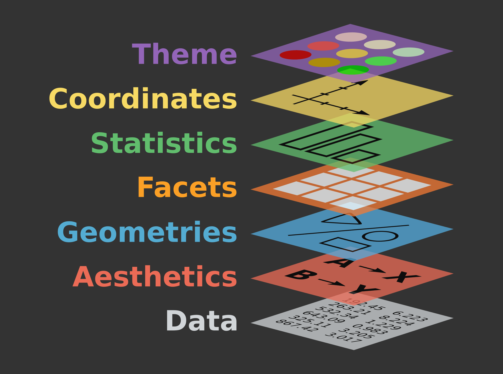
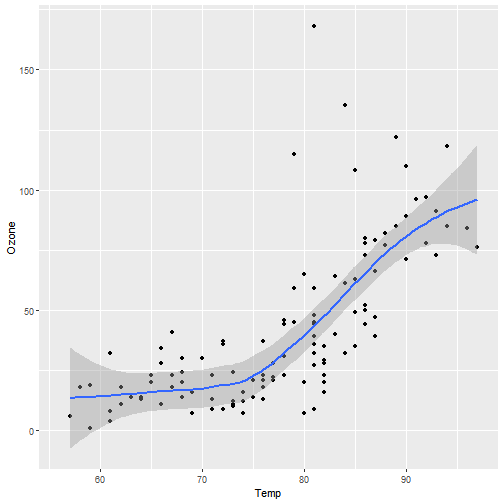
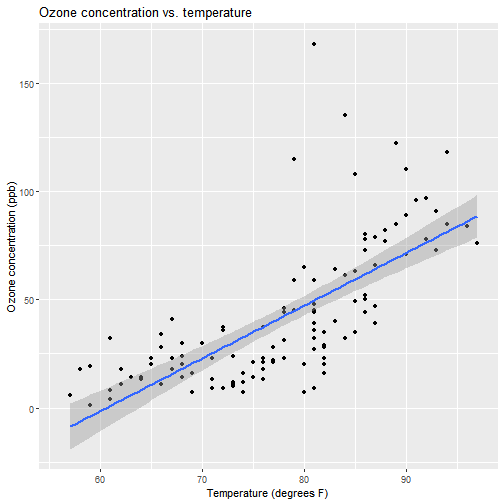
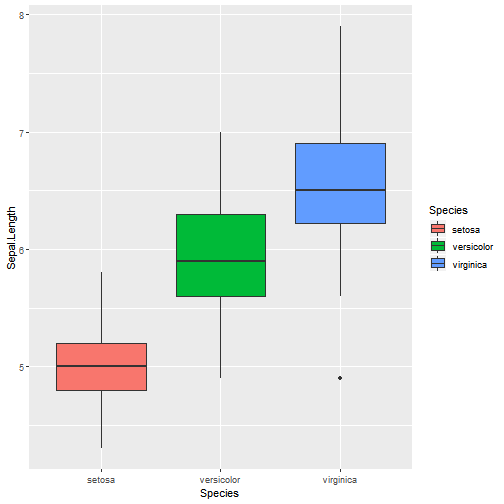
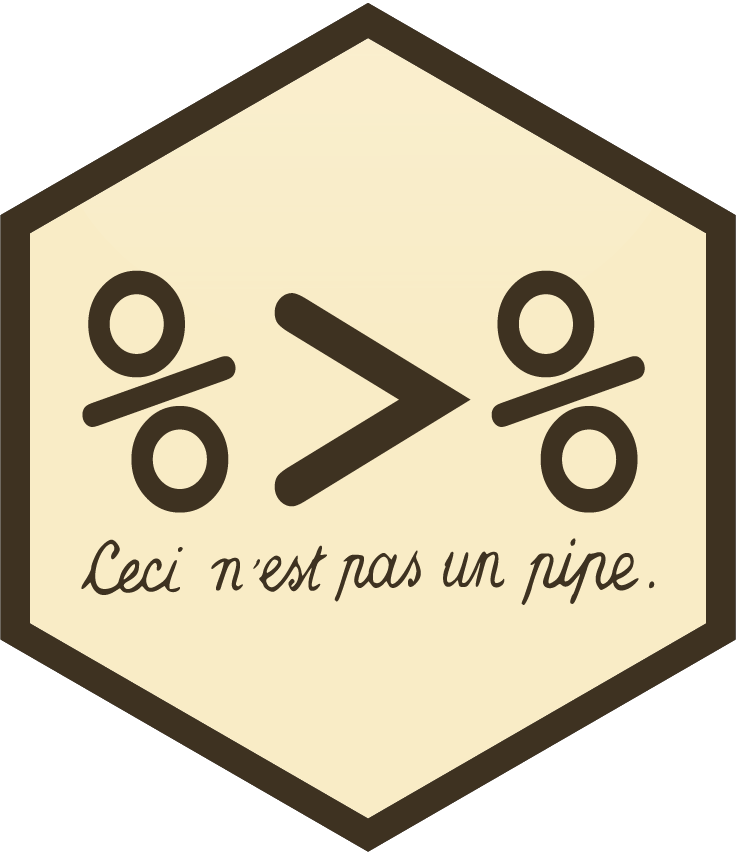

R-intro - Session #4
========================================================
author: Joao Goncalves
date: 02 August 2018
autosize: true
css: custom.css


The ggplot2 package
========================================================
type: section


ggplot2
========================================================
class: small-code
left:20%


---

- _ggplot2_ is a powerful data visualization package for the statistical programming language R providing an alternative for making graphs in this software.

- The creators of _ggplot2_ define it as: 

_"a system for declaratively creating graphics, based on The Grammar of Graphics. You provide the data, tell ggplot2 how to map variables to aesthetics, what graphical primitives to use, and it takes care of the details."_


Grammar of graphics (gg)
========================================================
class: small-code
left: 20%


---

- Put simply, a statistical graphic is a mapping of data variables to aesthetic attributes of geometric objects. 

- So, building on this, the basic idea behind the __Grammar of Graphics__ is to break up graphs into semantic components and thus giving you the ability to independently specify each building block of a plot. 

- Combining them allows to create just about any kind of graphical display you want.


Grammar of graphics (gg)
========================================================
class: small-code




ggplot examples
========================================================
class: small-code


```r
library(ggplot2)

g <- ggplot(data = airquality, mapping = aes(x = Temp, y = Ozone)) + 
     geom_point() + 
     geom_smooth()

plot(g)
```




ggplot examples
========================================================
class: small-code


```r
g <- ggplot(data = airquality, mapping = aes(x = Temp, y = Ozone)) + 
     geom_point() + 
     geom_smooth(method = "lm") + 
     labs(x="Temperature (degrees F)", y="Ozone concentration (ppb)", 
          title="Ozone concentration vs. temperature")

plot(g)
```




ggplot examples
========================================================
class: small-code


```r
# A boxplot for the Sepal length distribution
g <- ggplot(data = iris, mapping = aes( y=Sepal.Length, x=Species, fill=Species)) + 
     geom_boxplot()

plot(g)
```




The dplyr package
========================================================
type: section


What is dplyr?
========================================================
class: small-code
left: 10%


---

- `dplyr` is a powerful R-package used to transform and summarize tabular data (typically a dataframe)

- It is built to be fast, highly expressive, and open-minded about how your data is stored


Why is it useful?
========================================================
class: small-code
left: 10%


---

- The `dplyr` package is one of the most useful packages in the `tidyverse` to manipulate data in R, 

- Offers a more expressive, human-readable and friendly alternative to many base R functions

- The package contains a set of functions (or "verbs") that perform common data manipulation operations 

- Examples of these operations are: filtering rows, selecting specific columns (or column ranges), re-ordering rows, adding new columns and summarizing data


Important dplyr verbs to remember
========================================================
class: small-code
left: 10%


---

`dplyr` aim is to provide a function (or "verb") for each type of data manipulation thus helping you to translate your thoughts into code. Here are some of the most important ones:


| _dplyr_ verbs    | Description
| ---------------- | ------------------------------------------ |
| `select()` 	     | Select columns
| `filter()`	     | Filter rows by certain conditions
| `arrange()` 	   | Re-order or arrange rows
| `mutate()` 	     | Create new columns
| `group_by()` 	   | Allows for group aggregation operations
| `summarise()`    | Summarise values by groups


An example
========================================================
class: small-code
left: 10%


---


```r
# Select iris specimens with sepal length higher than 7 (cm)
filter(iris, Sepal.Length > 7)

# This is equivalent to:
iris[iris$Sepal.Length > 7, ]

# Combining multiple conditions (using the comma is equivalent to using & (AND) operator)
filter(iris, Sepal.Length > 7, Sepal.Width < 3.5)

# Get the iris species virginica and versicolor
filter(iris, Species %in% c("viriginica","versicolor"))
```


The pipe operator: %>%
========================================================
class: small-code
left: 15%



---

- This operator allows you to pipe the output from one function to the input of another one

- Easier to combine multiple `dplyr` functions for data manipulation. 

- The idea of of piping is to read the functions from left to right.

- Makes the code more readable and easier to understand.


```r
library(magrittr)
library(dplyr)

iris %>% 
  filter(Species == "virginica") %>% 
  arrange(desc(Sepal.Length)) %>% 
  head(5)
```

```
  Sepal.Length Sepal.Width Petal.Length Petal.Width   Species
1          7.9         3.8          6.4         2.0 virginica
2          7.7         3.8          6.7         2.2 virginica
3          7.7         2.6          6.9         2.3 virginica
4          7.7         2.8          6.7         2.0 virginica
5          7.7         3.0          6.1         2.3 virginica
```


