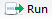
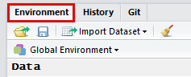
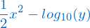

```{r setup, include=FALSE}
knitr::opts_chunk$set(echo = TRUE)
```


# Overview


In this introductory course to R you will learn how to master the basics of this beautiful and immensely useful open-source language. R currently has a growing number of users and its applications in both academia and in the private sector are also increasing in a yearly basis.  

The course will provide an introduction to the fundamental elements of R, starting from basic data structures and functions up to more complex stuff such as `if` conditionals and `for` loops. With the knowledge acquired from this course, you will be ready to undertake your own data analysis and be capable of pursuing more advanced topics. 

Our exploration will start by focusing on some key aspects of R as programming language, its syntax and slowly introduce some of the functions used for basic statistics such as those used for summarizing data (e.g., mean, standard-deviation), pairwise correlation or linear models.


# Pre-requisites


Don't worry we will start slowly! :-) As such, you don't really need any prior knowledge of computer programming (although some previous experience will make things easier) however, some familiarity with basic mathematical and statistical concepts and notions is assumed (e.g., distributions, centrality and dispersion measures, quantiles). 


# Course content by session


## Session 1


 - Exploring RStudio environment and workflow
 
 - Understanding the very basics of Rmarkdown
 
 - Starting a work session
 
 - Using the help system
 
 - R as a (sophisticated) calculator
 
 - Vectors and matrices: understanding the differences
 
 - Indexation by position, name or using logical conditions 
 

## Session 2


 - Time for recap session #1

 - Factors
 
 - Lists

 - Functions 
 
 - If conditionals 
 
 - For loops 
 
 - Combining all together

 - Working with dataframes
 
 - Data import/export in different formats
 

## Session 3


 - Time for recap session #2

 - Linear models in R: intro notes

 - Checking model assumptions
 
 - Building linear models in R
 
 - Checking model fit and interpreting results
 
 - Model cross-validation (time to practice `for` loops)


## Session 4?

 - An intro to the tidyverse:

   - Summarizing data with dplyr
 
   - Making pretty plots in ggplot2

 - Other topics in R-intro??

<!--chapter:end:R-intro-course-contents-program.Rmd-->

---
title: 'R-intro: software installation in Windows'
author: "João Gonçalves"
date: "7 de Julho de 2018"
output:
  pdf_document:
    toc: true
    toc_depth: 4
    fig_height: 0.5
  html_document: default
---


# Installing the required software for the course


The following software are required/mandatory to the course:

- _R_ version 3.5 (as of 7/7/2018) [http://cran.radicaldevelop.com/] (the portuguese CRAN mirror)

- _RStudio_ version 1.1.453 (as of 7/7/2018) [https://www.rstudio.com/products/rstudio/download/#download]


# Installing optional software for the course


The following software is optional (but recommended) to this R-intro course. Since the course will mainly be developed in Rmarkdown format, it is generally a good idea enabling RStudio to create pdf files. We will also install a set of functionalities that will
allow R to build package in Windows-

Enabling R to build packages in Windows:    

- Install _RTools_ - check which version corresponds to your installed R (usually the most recent is recommended) [https://cran.r-project.org/bin/windows/Rtools/index.html]


Enabling R to build pdf files from RMarkdown/LaTeX:

- Install _MiKTeX_ from [https://miktex.org/download]


### RTools and MiKTeX post-installation


After installing these two programs, verify if the _Path_ environmental variable (go to: Control Panel > System > Advanced > Environmental variables) actually contains the two following paths for _Rtools_ and _MiKTeX_ binaries:

- __"C:/Rtools/bin"__ (this may be different depending on the installation path of RTools)

- __"C:/Rtools/gcc-X.xx/bin"__ (X.xx - version number of the compiler; this may be different depending on the installation path of RTools)

- __"C:/MiKTeX/miktex/bin/x64/"__ (also depends on MiKTeX installation path)

<!--chapter:end:R-intro-Installing-software.Rmd-->

---
title: 'R-intro: session 1'
author: "João Gonçalves"
date: "7 de Julho de 2018"
output:
  pdf_document:
    toc: true
    toc_depth: 4
    fig_height: 0.5
  html_document: default
---

```{r setup, include=FALSE}
knitr::opts_chunk$set(echo = TRUE)
```


# Objectives of session 1


 - Exploring RStudio environment and workflow
 
 - Understanding the basics of Rmarkdown
 
 - Starting a work session
 
 - Using the help system
 
 - R as a (sophisticated) calculator
 
 - Vectors and matrices: understanding the  differences
 
 - Indexation and sub-setting
 

# Starting a work session in R/RStudio

1. Create a new directory/folder where all the elements of the session will be saved to. Avoid folder names with special characters (i.e., \ / : * ? “ < > | [ ] & $ , .).

2. In RStudio define the working directory using the folder created in step I.2. To do this in RStudio graphical interface go to: Session > Set Working Directory > Choose directory…. This procedure can also be done using the following line of code (don’t forget to use the correct path within the quotation marks!):


```{r eval=FALSE, include=TRUE}

# select the line and press Ctrl + Enter
# Note: if you use the backslash to enter your working directory
# don’t forget to escape it using a double backslash, i.e.:
# "C:\\Users\\myUserName\\Documents\\R-intro"

setwd("C:/Users/myUserName/Documents/R-intro")


```


3. In the following sections start by inspecting and testing the examples (inside the grey boxes) and then try to solve the exercises. Copy the content of the box to your script file then select the line(s) you want to test and press the "Run" button > "Run Selected Line(s)" (Figure 1) or press _"Ctrl" + "Enter"_


         
or Ctrl + Enter. 

Note 1) if the R prompt gets too cluttered just click on its window tab and then press Ctrl + L; 

Note 2) if you want to see which objects are currently listed in the R session just go to the following window tab (Figure 2) 


      
         
Alternatively, you can type `ls()` followed by "Enter"" directly in the R console to see a list of the objects (of course if you do this right on the beginning of the session then R Environment will be empty or it will issue character(0) which means that no objects or data were created yet… ;-)

Note 3) In R comments or notes can be inserted after the hash tag sign # (the R compiler just ignores what is after #). Use this to organize your scripts and to enter additional notes that you would like to remember after.


# Using the help system


R has a very efficient help system that should be used whenever a question or doubt appears about a certain function, operator or data structure. Besides documentation regarding each individual function or procedure this system also contains several working examples.

```{r eval=FALSE, include=TRUE}

# Allows to search the help system about the term or expression 
# within the quotation marks

help.search("anova", package="stats")
??"k-means"

# This allows to search the help system about the function of 
# interest - notice that the function name is passed after the 
# question mark

help("mean")
?range

# Run all examples for that function name

example(summary)
example(plot)

```


### Exercises 1 & 2


1.	Using help() or ? look for the information on the mean, sd, quantile and mad functions. Which statistical metrics do these functions calculate?

```{r eval=TRUE, include=TRUE}

#1)


```


2.	Using help.search() or ?? find the functions that are used to calculate:
   a)	The weighted-mean;
   b)	The pairwise correlation;
   c)	A linear model.

```{r eval=FALSE, include=TRUE}

# 2a)

```

```{r eval=FALSE, include=TRUE}

# 2b)

```

```{r eval=FALSE, include=TRUE}

# 2c)

```


# Operations with vectors


## Basic operations


In R, vectors are objects or variables with one or more values of the same type: logical, integer, numeric (synonym of double), complex or character. 

The assignment operator (`<-`) allows to assign a value or a series of values (on the right-hand side) to a variable name (placed on the left).

Typically if some value is correctly assigned to a variable R will show no output whatsoever. To visualize it you have either to put the variable name in the console and press 'Enter' or use functions such as `print()` 

See the examples below for the assignment operator and basic algebraic calculations:

```{r eval=FALSE, include=TRUE}

# The basics of the assignment operator (<-)

x <- 12.7 # numeric
y <- 25 # integer
w <- "foo bar" # words/strings are enclosed inside quotation marks

# Algebraic operations

x / y          # division
x * y          # multiplication
x + 7.2        # sum
z <- 10.2 - y  # subtraction
print(z)       # shows the value of z

y ^ 3          # power
sqrt(y)        # square-root
log10(x)       # logarithm of base 10

cos(pi / 4)    # co-sine, pi=3.141593… is a R constant
sin(pi / 4)    # sine
tan(pi / 4)    # tangent


```


### Exercise 3


3. Create the variables x and y respectively with the following values: 10.2 and 5.7. In case of doubts, check the following help entry regarding arithmetic operators: `?Arithmetic`

Now, calculate the expressions in each of the following equations:      

a) 


```{r  eval=TRUE, include=TRUE}

# 3a)

```

b)      


```{r  eval=TRUE, include=TRUE}

# 3b)

```

c)
         

Calculate the above expression and use `print()` function to see the calculated value in `z`  

```{r  eval=TRUE, include=TRUE}

# 3c)

```

d) Get the value of z (from the previous exercise) with one decimal plate only (use the function `round()`; see the help system using `?round` to check the arguments of this function);

```{r  eval=TRUE, include=TRUE}

# 3c)

```


## Concatenating multiple values in vectors


In R, the concatenation function `c()` is used for inputting multiple values in vectors each one of them separated by a comma. There are also functions such as `length()` that allow us to see on many elements there are in a vector. In addition, vectors can also have different names for each element. Check the examples below to see more details:


```{r eval=FALSE, include=TRUE}

# Input a series of values using the concatenation function c()
# Each value is separated by a comma

elevation <- c(348, 690, 1005, 870)
station   <- c("Chaves", "Bragança", "Montalegre", "Lamas de Mouro")

print(elevation)
print(station)

length(elevation)           # the size of the vector

names(elevation) <- station # defines the name of each element
print(elevation)

# Basic statistics

min(elevation)  # minimum value
max(elevation)  # maximum value
mean(elevation) # average value
sd(elevation)   # standard-deviation

```

Now that you run the examples above try answering the following questions.

### Exercise 4


4. Using the concatenation function `c()`, which allows to input multiple values, create a variable named `t.max` with the following twelve numeric values:

 -    20.7, 18.9, 20.8, 18.8, 19.2, 18.6, 20.5, 20, 19.1, 21.3, 16.9, 18.6     

These values are related to the average temperature of the hottest month (a bioclimatic variable) for several Portuguese climatic stations. 

```{r eval=TRUE, include=TRUE}

# t.max vector

```

Next, create a string (or character) variable named `est.clim` containing the names of the climatic stations associated with the temperature records: 

 -    "Anadia", " Mira", "Nelas", "Guarda", "Caramulo", "S. Jacinto", "Viseu", "S. Muna", "Estarreja", "Fig. Cast. Rodrigo", "Arouca", "Moimenta"    

```{r eval=TRUE, include=TRUE}

# est.clim vector

```

Using the vectors previously created, solve the next exercises:        


a) Add 100 to `t.max` and then calculate the square-root. What happens to the vector? Were the functions applied on one or all the elements of the vector?

```{r eval=TRUE, include=TRUE}

# 4a)

```

b) Determine the size of the `est.clim` vector. Which function did you use?

```{r eval=TRUE, include=TRUE}

# 4a)

```

c) Calculate the mean and the standard-deviation of `t.max`;

```{r eval=TRUE, include=TRUE}

# 4a)

```

d) Calculate `t.max` quartiles and plot them (check functions quantile and boxplot). Which is the median value of `t.max`?

```{r eval=TRUE, include=TRUE}

# 4a)

```


## Generating sequences of values

R has several ways to generate numeric sequences. These are particularly useful to generate data or simply to select/subset elements in vectors, matrices or data frames.

Check the examples below for generating sequences in R:

```{r eval=FALSE, include=TRUE}


# The : operator allows to generate regular sequences of integers from a to b (a:b)

a <- 1:10
print(a)

b <- 10:-10
print(b)

# Using the function seq() it’s possible to generate sequences with a 
# defined start, end, length or incrementing by a certain amount

seq(from = 1, to = 5, length = 4) # [1] 1.000 2.333 3.667 5.000
seq(length = 10, from = -2, by = 0.2) # [1] -2.0 -1.8 ... -0.2

# The function rep allows to replicate values

rep(x=c(1,2,3), times=2)
rep(x=c(1,2,3), times=2, each=3)

```


### Exercise 5


a) Create a vector named k containing a regular sequence from 10 to 100 using the colon `:` operator. Calculate the sum of all elements in k (check function `sum()`);

```{r eval=TRUE, include=TRUE}

# 5a)

```

b) Create a vector named v containing a sequence of values from $-\pi$ to $\pi$ with intervals of $\pi / 100$ using the function `seq()`. Then, make a xy-plot of $u = sin(v)$ using the values previously inputted in v (check function `plot()` for making this graph).

```{r eval=TRUE, include=TRUE}

# 5b)

```


## Logical operations


R has several logical operators, namely: `>` (greater than), `>=` (greater than or equal to), `<` (less than), `<=` (less than or equal to), `==` (exactly equal to), `!=` (not equal to), `!x` (not x), `x | y` (x OR y), `x & y` (x AND y).

These operators are very useful to compare values, control certain routines or to select elements in vectors or matrices.


```{r eval=FALSE, include=TRUE}
# Check if a is greater than b:

a <- 12.7
b <- 25.9
a > b

# Check which values of a verify a certain condition
# TRUE if yes and FALSE otherwise

a <- 1:20
a >= 10

# Generate a sequence with 20 randomly distributed values and check
# which ones are greater than the average:

b <- rnorm(20)
b > mean(b)

```


### Quick exercises

After running the above examples try answering the next questions:


- Have you noticed what happened when a logical operation is performed on a vector (with multiple values)? Is this operation applied to a single value or to all values in the vector - select the correct answer: 

a) Only applied to the first element of the vector

b) The first five elements

c) All elements

```{r}
# Put here the correct answer inside the quotation marks:
print("")
```

- Which Boolean value appears when a condition is positively verified and what is the corresponding integer value? Select the correct answer:

a) TRUE which means 0

b) FALSE which means 0

c) TRUE which means 1

d) FALSE which means 1

```{r}
# Put here the correct answer inside the quotation marks:
print("")
```

- Without running the following R code fragment `sum( (1:10) > 5 )` try to guess what would be the correct output for it - select the correct answer:

a) 1

b) 2

c) 3

d) 4

e) 5

```{r}
# Put here the correct answer inside the quotation marks:
print("")
```


## Vector indexation


Any element (or set of elements) contained in a vector or matrix can be accessed through its index (or indices). 

To do this in R, the square brackets operator is used after the variable name, for example: x[3] which will select the 3rd element of `x`, or, `x[c(1,3,5)]` which will select the elements in the 1st, 3rd and 5th positions. 

Besides positions given by integer values, indices can also use logical or name values. Using indices also allows to change certain specific or ranges of values contained in vectors (or matrices). 

Check the examples below:


```{r eval=FALSE, include=TRUE}

x <- seq(from = 10, to = 500, length = 20)
names(x)<- LETTERS[1:20] # name each element of x with a letter

print(x)

x[2]          # Get the value in the 2nd position
x[-2]         # Select all elements of x except the 2nd position
x[1:4]        # Select elements of x from the 1st to the 4th positions
x[-(1:3)]     # Select all elements except those from 1 to 3
x[c(7,10,12)] # Select elements on positions 7, 10 and 12

x["H"]        # Get x element with name "H"

x[x < 145]                # Select elements with less than 145
x[(x >= 100) & (x < 220)] # Elements within the interval [100, 220[

# Change values:
x[5] <- 100 # Change the value in position 5
x[10] <- NA # Change the value in position 10 to ‘no data’ (NA)

```


### Exercise 6 (logical operations and vector indexation)

6. Using the data generated in exercise 4 (the vectors `t.max` and `est.clim`) solve the following exercises:

a)	Assign the names of the climatic stations (`est.clim`) to the temperature records (`t.max`) using the function `names()`. Check the examples in the help system;

```{r eval=TRUE, include=TRUE}

# 6a)

```

b)	Select the first five elements of `t.max` using a sequence of integers;

```{r eval=TRUE, include=TRUE}

# 6b)

```

c)	Get the temperature values for stations "Anadia" and "Nelas" (using selection/indexation by name);

```{r eval=TRUE, include=TRUE}

# 6c)

```

d)	Which climatic stations have temperature values above 20 ºC and below or equal to 21 ºC;

```{r eval=TRUE, include=TRUE}

# 6d)

```

e)	Change the value of the "Guarda" station to 19 ºC;

```{r eval=TRUE, include=TRUE}

# 6e)

```


# Matrix operations


Matrices in R allow to efficiently store and organize data of one type (logical, numeric, character, etc.) in a bi-dimensional structure (rows × columns). 

It is possible to use names for the rows and the columns to select them appropriately. 

Matrices also allow specific operations to be performed, such as multiplication (%*%), the transpose (t() function), the determinant (det() function) or solving systems of linear equations of the type Ax = b using the function solve().


## Generating matrices


From a vector of data and using the function matrix it is possible to control several aspects of matrix generation. It is possible to choose the number of rows (nrow), columns (ncol) and the orientation of matrix filling (byrow). If FALSE (the default option) the matrix is filled by columns, otherwise the matrix is filled by rows. Also, the argument dimnames allows to set the names of rows and columns.


```{r eval=FALSE, include=TRUE}

# Generate the 3 × 3 identity matrix:
id <- matrix(c(1,0,0,0,1,0,0,0,1), nrow = 3)

# Generate a matrix with 2 rows filled by row:
vector<-c(1,2,3,4,4,3,2,1)
v <- matrix(vector, byrow = TRUE, nrow = 2)

# Generate a 10×10 matrix with filling by row:
m <- 1:100
dim(m) <- c(10, 10)  # or alternatively:
m <- matrix(data = 1:100, nrow = 10, ncol = 10, byrow = FALSE)

cbind(m, rnorm(10)) # Add a new column to m

rbind(m, rnorm(10)) # Add a new row to m

rownames(m) <- paste("row", 1:10, sep="_")  # Define row names

colnames(m) <- paste("col", 1:10, sep="_")  # Define column names

```


## Matrix indexing


Accessing elements in matrices is similar to vectors. However, since this structure is bi-dimensional, two indices [row, col] are used inside square brackets. See the next examples.

# x[i, j]  # Select the i-th line e a j-th column of x
# x[i, ]   # Select the line i and all columns
# x[, j]   # Select the column j and all lines

```{r eval=FALSE, include=TRUE}

# Matrix indexation

m[, 1:5]         # Select columns 1 to 5
m[1:5, ]         # Select lines 1 to 5
m[-c(1,3,5), ]   # Exclude lines 1, 3 and 5

m[, c(1,2,10)] # Select columns 1, 2 and 10.
m[,-1]         # Select all columns except the first

m[, c("col_8", "col_10")]           # Select by column name
m[c("row_1"), c("col_8", "col_10")] # Select by row and column name

# When a given matrix (or data frame) index has dimension one, the 
# drop=FALSE argument allows to keep the matrix format instead of 
# automatically converting it to a vector 

m[,1,drop="FALSE"]  # a column (the parameter drop=TRUE
m[1,,drop="FALSE"]  # a line

```


### Exercise 7

7. The Ministry of Health performed a survey about the average percentage of smokers by gender and city in several schools of the country. Using the data in the table below answer the following questions:


	      Aveiro	Braga	Bragança	Porto	Coimbra	Covilhã	Leiria	Lisboa	Setúbal	Faro
	      
Women	   50.3	   60.6	  71.5	   82.3	  59.9	 79.3	   41.4	   80.9	   72.1	  59.1

Man	     54.4	   52.4	  67.1	   78.3	  59.2	 65.1	   86.3	   81.3	   57.3	  61.3


a) Which type of data structure (or object type) is more suited to store this information in R - select the correct answer 

  i) One vector with all values
 
  ii) Two vectors with named values
  
  iii) A list
  
  iv) A matrix

```{r eval=TRUE, include=TRUE}

# 7a) The correct option is:
print("")
```

b) Using the type of object selected in a) insert the data into that type of structure (hint: including row and column names)
	
```{r eval=TRUE, include=TRUE}

# 7b)

```
	
c) Which is the average percentage of male smokers?
	
```{r eval=TRUE, include=TRUE}

# 7c)

```
	
d) Find/select the two cities with the highest percentage of smoker women (hint: see `?sort`)

```{r eval=TRUE, include=TRUE}

# 7d)

```
	
e) In which city is the difference between man and women higher?

```{r eval=TRUE, include=TRUE}

# 7e)

```

f) For each city indicate which gender has the highest percentage of smokers (hint: see `?apply` and `?which.max` for a possible solution).

```{r eval=TRUE, include=TRUE}

# 7f)

```

 


<!--chapter:end:R-intro-session-01.Rmd-->

